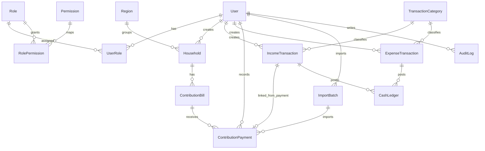

# Database

## Ringkasan

Database memakai PostgreSQL dengan Prisma. Model saat ini sudah mencakup auth/RBAC, master data jamaah, iuran, transaksi kas, ledger, import batch, dan audit.

## ERD ringkas

## Enum aktif

- `AppRoleKey`: `ADMIN`, `TREASURER`, `AUDITOR`
- `PermissionKey`:
  - `MANAGE_USERS`
  - `MANAGE_SETTINGS`
  - `MANAGE_REGIONS`
  - `MANAGE_HOUSEHOLDS`
  - `MANAGE_CONTRIBUTIONS`
  - `MANAGE_INCOME`
  - `MANAGE_EXPENSES`
  - `VERIFY_TRANSACTIONS`
  - `VIEW_REPORTS`
  - `VIEW_AUDIT_LOG`
- `HouseholdStatus`: `ACTIVE`, `INACTIVE`
- `PaymentMethod`: `CASH`, `BANK_TRANSFER`, `QRIS`, `OTHER`
- `BillStatus`: `BELUM_BAYAR`, `SEBAGIAN`, `LUNAS`, `DIBEBASKAN`, `DIBATALKAN`
- `IncomeStatus`: `DRAFT`, `VERIFIED`, `CANCELED`
- `ContributionPaymentStatus`: `DRAFT`, `VERIFIED`, `CANCELED`
- `ExpenseStatus`: `DRAFT`, `PENDING_VERIFICATION`, `VERIFIED`, `REJECTED`, `CANCELED`
- `ImportBatchStatus`: `PENDING`, `PROCESSING`, `COMPLETED`, `FAILED`
- `CategoryType`: `INCOME`, `EXPENSE`
- `LedgerDirection`: `DEBIT`, `CREDIT`
- `LedgerSourceType`: `CONTRIBUTION_PAYMENT`, `INCOME_TRANSACTION`, `EXPENSE_TRANSACTION`, `REVERSAL`

## Model utama

### Auth dan RBAC

- `User`
- `Role`
- `Permission`
- `RolePermission`
- `UserRole`

Catatan:

- user aktif disimpan di `User.isActive`
- role utama user saat login diambil dari relasi `UserRole`

### Organisasi dan konfigurasi

- `MosqueProfile`
- `ContributionSetting`
- `SystemSetting`

Catatan:

- `MosqueProfile` saat ini juga menyimpan nominal iuran default, nominal iuran khusus, konfigurasi fiscal year, dan `requireExpenseApproval`
- `ContributionSetting` tetap ada sebagai model konfigurasi iuran aktif

### Master data

- `Region`
- `Household`

Catatan:

- `Region` dan `Household` mendukung soft delete lewat `deletedAt`
- `Household` menyimpan `createdById` dan `updatedById`

### Domain iuran

- `ContributionBill`
- `ContributionPayment`
- `ImportBatch`

Catatan penting:

- `ContributionBill` unik per `householdId + year + month`
- `ContributionPayment.receiptNumber` unik
- `ContributionPayment.importSourceKey` juga unik untuk membantu idempotency import
- `ImportBatch` melacak progress import Excel pembayaran iuran

### Domain kas

- `TransactionCategory`
- `IncomeTransaction`
- `ExpenseTransaction`
- `CashLedger`

### Audit dan file metadata

- `AuditLog`
- `Attachment`

Catatan:

- `Attachment` sudah ada di schema tetapi belum menjadi workflow upload transaksi umum

## Constraint penting

- `User.email` unik
- `Role.key` unik
- `Permission.key` unik
- `RolePermission(roleId, permissionId)` unik
- `UserRole(userId, roleId)` unik
- `Region.name` unik
- `Household.code` unik
- `ContributionBill(householdId, year, month)` unik
- `ContributionPayment.receiptNumber` unik
- `ContributionPayment.incomeTransactionId` unik
- `ContributionPayment.importSourceKey` unik
- `ImportBatch(sourceFileHash, targetYear)` unik
- `TransactionCategory(name, type)` unik
- `IncomeTransaction.transactionNumber` unik
- `ExpenseTransaction.transactionNumber` unik
- `CashLedger(sourceType, sourceId, isActive)` unik
- `SystemSetting.key` unik

## Index yang aktif

- `Household(headName)`
- `Household(regionId)`
- `Household(status)`
- `ContributionBill(year, month)`
- `ContributionBill(status)`
- `ContributionPayment(status)`
- `ContributionPayment(paymentDate)`
- `ContributionPayment(importBatchId)`
- `ImportBatch(targetYear)`
- `ImportBatch(status)`
- `ImportBatch(createdAt)`
- `IncomeTransaction(status, transactionDate)`
- `ExpenseTransaction(status, transactionDate)`
- `CashLedger(transactionDate)`
- `AuditLog(entity, entityId)`
- `AuditLog(createdAt)`

## Aturan iuran yang tercermin di schema

- satu tagihan per keluarga per bulan per tahun
- satu pembayaran dapat terhubung ke tepat satu `IncomeTransaction`
- tagihan menyimpan status agregat, sementara pembayaran menyimpan event pembayaran aktual
- tagihan yang dibatalkan memakai `canceledAt`, bukan hard delete
- pembayaran yang dibatalkan memakai `canceledAt`, bukan hard delete

## Aturan ledger

`CashLedger` adalah sumber kebenaran saldo.

Kolom penting:

- `direction`
- `sourceType`
- `sourceId`
- `transactionNumber`
- `amount`
- `isActive`
- `incomeId`
- `expenseId`

Aturan implementasi saat ini:

- kas masuk dipost sebagai `DEBIT`
- kas keluar dipost sebagai `CREDIT`
- reversal memakai `sourceType = REVERSAL`
- halaman buku kas hanya membaca `isActive = true`
- running balance dihitung dari urutan transaksi, bukan dari kolom saldo tersimpan

Catatan implementasi:

- reversal saat ini menambah entry lawan arah dan membiarkan entry asal tetap aktif
- karena itu saldo aktual adalah hasil agregasi seluruh ledger aktif, termasuk reversal

## Import batch pembayaran iuran

`ImportBatch` dipakai untuk import XLSX pembayaran iuran:

- identitas batch: `sourceFileHash + targetYear`
- menyimpan status progress
- menyimpan ringkasan hasil
- menyimpan detail error dalam JSON
- menghubungkan pembayaran hasil import melalui `importBatchId`

Kolom penghitung yang aktif:

- `totalRows`
- `processedRows`
- `createdPayments`
- `skippedPayments`
- `failedRows`
- `spilledPayments`

## Audit data

`AuditLog` menyimpan:

- `userId`
- `action`
- `entity`
- `entityId`
- `beforeData`
- `afterData`
- `ipAddress`
- `userAgent`
- `createdAt`

Saat ini IP dan user agent belum selalu diisi di semua call site. Kolom tetap tersedia untuk pengembangan berikutnya.

## Environment database

- runtime Prisma: `POSTGRES_PRISMA_URL`
- migration/direct connection: `POSTGRES_URL_NON_POOLING`
- contoh local dan production ada di `.env.development.example` dan `.env.production.example`
