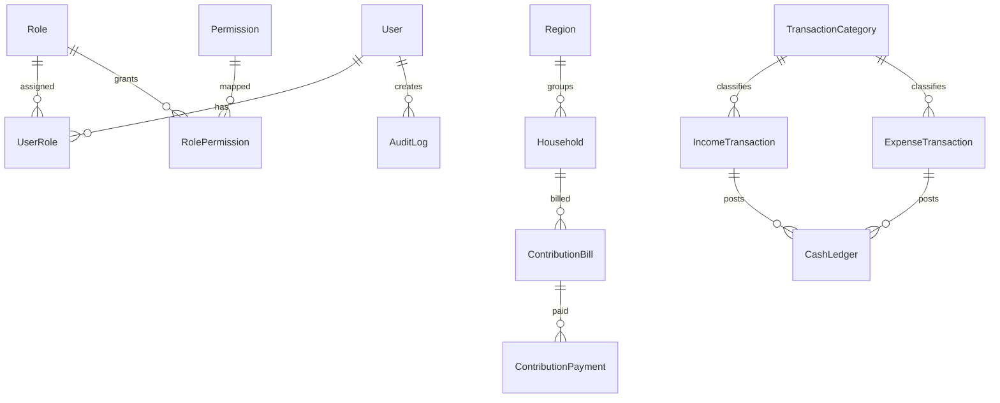

# Database

## ERD Ringkas

## Constraint Penting

- `Household.code` unik
- `ContributionBill(householdId, year, month)` unik
- `ContributionPayment.receiptNumber` unik
- `IncomeTransaction.transactionNumber` unik
- `ExpenseTransaction.transactionNumber` unik
- `CashLedger(sourceType, sourceId, isActive)` unik

## Aturan Ledger

- ledger aktif dengan arah `DEBIT` menambah saldo
- ledger aktif dengan arah `CREDIT` mengurangi saldo
- pembatalan transaksi menonaktifkan ledger aktif terkait
- laporan dan dashboard membaca ledger aktif

## Index MVP

- `Household(headName)`
- `Household(regionId)`
- `ContributionBill(year, month)`
- `ContributionBill(status)`
- `IncomeTransaction(status, transactionDate)`
- `ExpenseTransaction(status, transactionDate)`
- `AuditLog(entity, entityId)`

## Environment Untuk Database

- Development lokal memakai `.env.development.local`.
- Production memakai `.env.production.local` atau environment variable dari platform deploy.
- Prisma runtime membaca `POSTGRES_PRISMA_URL`.
- Prisma migration / direct connection membaca `POSTGRES_URL_NON_POOLING`.
